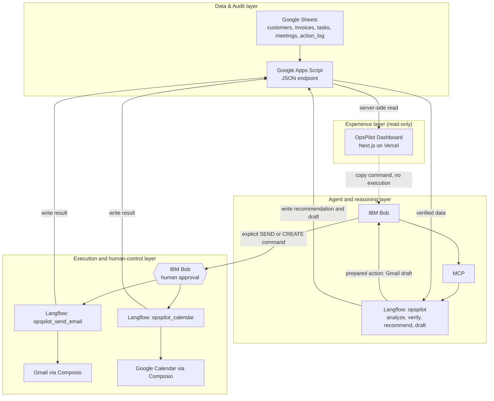

# OpsPilot

**AI Revenue Operations Agent for Small B2B Businesses**

> *Know what needs attention and act on it faster.*

OpsPilot helps the owner or operations lead of a small B2B service business (roughly 2–20 people) see which customers, invoices, tasks and meetings need attention today, prepare the follow-up, and execute it **only after explicit human approval**, with every step recorded in an audit trail.

- **Live dashboard:** <https://opspilot-snowy.vercel.app/>
- **Theme:** Productivity & Smart Business
- **Data note:** all data in the demo is **synthetic demonstration data**, not real customer or business data.

---

## Problem

In a small B2B business, customer follow-ups, invoices, tasks, deadlines and meetings live in different places. The operator keeps repeating the same loop by hand:

1. inspect operational data
2. work out what needs attention
3. decide priorities
4. prepare the follow-up
5. execute the action
6. remember what was already done

Things slip: a lead goes quiet, an invoice stays unpaid, a follow-up is sent twice or not at all.

## Solution

OpsPilot turns that loop into a single, explainable flow:

```
Operational Data → Analysis → Prioritization → Recommendation
                 → Human Approval → External Action → Audit Trail
```

It is made of two cooperating parts:

| Part | What it does | Where it lives |
|---|---|---|
| **OpsPilot Dashboard** | Operational visibility, priority monitoring, decision support, action lifecycle and audit history. **Read-only: it never sends email or creates calendar events.** | This repository (Next.js on Vercel) |
| **OpsPilot Agent** | Analyses the data, verifies entity context, recommends actions, prepares Gmail drafts, and runs approved actions through separate execution tools. | IBM Bob + MCP + Langflow (configured outside this repository) |

## How OpsPilot Works

1. **See it.** The dashboard reads the operational dataset and ranks what needs attention (overdue invoices, stale leads, urgent tasks, unprepared meetings).
2. **Decide.** Each item opens a detail drawer with context and a ready-to-copy **IBM Bob command**, for example `Handle INV-017`.
3. **Prepare.** In IBM Bob, the main Langflow flow verifies the entity, explains its recommendation and creates a Gmail **draft**. It does not send anything.
4. **Approve and execute.** The operator issues an explicit command (`SEND INV-017`, `CREATE TASK-025`). IBM Bob asks for human approval before the separate execution tool runs.
5. **Record.** The result is written to the `action_log`. The dashboard then shows the item as *Executed*, together with the evidence.

## Key Features

| Page | What it shows |
|---|---|
| **Overview** | Revenue at risk, attention items, open tasks, active opportunities, revenue-exposure and invoice-state charts, top priorities, recent activity |
| **Priorities** | Ranked operational queue across invoices, leads, tasks and meetings with deterministic severity, detail drawer and IBM Bob handoff |
| **Customers** | Account status, last contact, opportunity value, follow-up state and related invoices, tasks and meetings |
| **Invoices** | Paid/unpaid status, overdue state calculated from the due date, payment exposure, follow-up handoff |
| **Tasks & Meetings** | Open and overdue tasks, schedule state, meeting readiness, calendar handoff |
| **Action Center** | Lifecycle of each recommended action: **Recommended → Prepared → Executed**, plus **Approval Required**. Derived from the live data and the `action_log` |
| **Activity** | Audit trail of drafts, emails, calendar events, recommendations and execution issues, with human approval shown only when it was actually recorded |

Also: responsive layout with a mobile navigation drawer, a manual **Refresh data** control, and friendly error states.

## Architecture



The dashboard has **no path** to Gmail, Calendar, Langflow or MCP. It only reads data and copies commands. See [docs/architecture.md](docs/architecture.md) for the full description.

## Responsible AI

OpsPilot is designed so that the AI can analyze and recommend, but cannot act consequentially on its own.

- **Human in the loop.** Sending an email or creating a calendar event requires an explicit command *and* IBM Bob's human approval. The operator stays in charge.
- **Reasoning and execution are separated.** The main `opspilot` flow can analyse, recommend and create Gmail drafts. It cannot send email or create calendar events. Those actions exist only in two separate MCP tools, `opspilot_send_email` and `opspilot_calendar`, for which IBM Bob keeps approval enabled.
- **Agreement is not authorization.** *Natural-language agreement alone is not authorization for consequential actions.* This rule was enforced structurally after testing showed that relying only on agent instructions was not enough.
- **Verified entity context.** The agent works from entity IDs (such as `INV-017`) checked against the operational data before it recommends or prepares anything.
- **Transparent action state.** The Action Center shows exactly where each action stands (Recommended, Prepared or Executed) and which command is needed next.
- **Audit trail.** Every prepared and executed action is recorded in the `action_log` and shown on the Activity page. Human approval is displayed only when the log actually records it; success is never used to infer approval.
- **Duplicate protection.** The execution flow and IBM Bob guard against repeating an action that is already recorded as executed. The dashboard reflects this by offering no new execution command for executed items.
- **Fail closed.** If operational data cannot be loaded, the dashboard shows an error state. It never substitutes fake or empty data. Unknown statuses in the log are never treated as success.

Historical test records, including an old malformed failure entry, are intentionally kept visible in the audit log instead of being silently removed.

> The Langflow flows and IBM Bob configuration are not stored in this repository. The behaviors listed under the agent and execution layers above are properties of that configuration; the dashboard in this repository only displays their results.

## User Validation

Early, directional validation with **10 respondents** (not statistically representative):

| Finding | Result |
|---|---|
| Identified late customer follow-up as a pain point | 8 / 10 |
| Experienced late customer follow-up in the prior 3 months | 6 / 10 |
| Relevant respondents reporting invoice follow-up delay | 5 / 9 |
| Check operations at least twice per day | 8 / 10 |
| Average interest in AI assistance | about 3.8 / 5 (60% rated 4–5) |
| Would allow external AI messaging when rules or approval exist | 9 / 10 |

These numbers are early signals that the problem is real and that approval-gated AI is acceptable to this audience. They are not proof of market size or impact.

## Tech Stack

**Dashboard:** Next.js 16 (App Router), React 19, TypeScript, Tailwind CSS 4, Radix UI primitives with shadcn-style components, Recharts, Framer Motion, Lucide icons.
**AI / orchestration:** IBM Bob, Model Context Protocol (MCP), Langflow.
**External execution:** Composio, Gmail, Google Calendar.
**Operational data:** Google Sheets exposed through Google Apps Script.
**Deployment:** Vercel.

## Production Demo

**<https://opspilot-snowy.vercel.app/>**

The first request after a quiet period can take several seconds because the Apps Script endpoint is slow on cold requests; later requests are served from a short server-side cache.

Snapshot taken on 2026-10-02 (values change as the data changes):

| Area | Snapshot |
|---|---|
| Revenue at risk | Rp16.5 jt |
| Attention items | 8 |
| Open tasks | 5 |
| Active opportunities | Rp27 jt |
| Action Center | Recommended 5 · Prepared 0 · Executed 6 · Approval Required 3 |
| Activity | 17 records · 7 drafts created · 7 external actions executed · 1 historical execution issue |

## Demo Workflow

**Invoice follow-up: `INV-017` (overdue, PT Delta Konsultan, Rp5 jt)**

1. Open **Priorities** or **Invoices** and select `INV-017`. The drawer shows the overdue context and the command `Handle INV-017`.
2. In IBM Bob, run `Handle INV-017`. The agent verifies the invoice and prepares a Gmail **draft**. Nothing is sent.
3. Run the explicit command `SEND INV-017`. IBM Bob asks for human approval before `opspilot_send_email` runs.
4. The email is sent through Gmail and the result is written to the `action_log`.
5. In the dashboard, **Action Center** shows `INV-017` as *Executed* with its receipt, and **Activity** shows the draft and the send with the approval evidence.

**Calendar reminder: `TASK-025` (follow up revised proposal, PT Beta Kreatif)**

1. Open **Tasks** or **Action Center** and select `TASK-025`.
2. In IBM Bob, run `CREATE TASK-025`. IBM Bob asks for human approval before `opspilot_calendar` runs.
3. A Google Calendar event is created and logged. The dashboard shows it as *Executed*.

Because these items are already executed, the dashboard offers no further execution command for them, and the Activity page serves as the evidence.

## Project Structure

```
app/                  Routes: overview, priorities, customers, invoices, tasks, actions, activity
components/           UI by feature (overview, priorities, actions, activity, layout, shared, ui)
lib/opspilot/
  api.ts              Server-side data fetching (cache, timeout, bounded retry, fail-closed)
  metrics.ts          Deterministic business logic: KPIs, priorities, Action Center lifecycle
  activity.ts         Audit-log normalization and approval/status labels
  dates.ts            Asia/Jakarta date helpers
  types.ts            Domain and view-model types
  refresh.ts          Server Action that only refreshes cached dashboard data
docs/                 Architecture, demo script, screenshot plan, submission copy, demo checklist
```

## Local Development

```bash
npm install
npm run dev
```

Create `.env.local` with:

```bash
OPSPILOT_DATA_URL=<your Google Apps Script web app /exec URL returning the operational dataset as JSON>
```

The URL is read on the server only and must never be committed. The endpoint must return a JSON object with the arrays `customers`, `invoices`, `tasks`, `meetings` and `action_log`.

Other commands: `npm run lint`, `npm run build`, `npm run start`.

## Limitations

- The Apps Script endpoint can take several seconds on cold requests. The dashboard uses a short cache (about 20 seconds), a 12-second timeout and at most 2 attempts, then shows an error state.
- A malformed HTTP 200 response may stay cached for up to the 20-second window; the **Retry** control clears it.
- The dataset is **synthetic demonstration data**.
- The website is a monitoring and decision-support surface. It does not execute consequential actions, and human approval happens in IBM Bob, not in the dashboard.
- The audit log is read from a Google Sheet. The dashboard displays it faithfully but does not itself enforce tamper-resistance.
- Historical test records, including a malformed failure entry, remain visible by design.
- No authentication or multi-tenant management in this MVP.
- No accounting or payment execution; no full CRM or ERP functionality.
- Langflow flows and IBM Bob configuration are outside this repository.

## Future Development

- Deeper CRM integrations as data sources
- Configurable operational policies (for example follow-up thresholds)
- Broader revenue signals beyond invoices, leads, tasks and meetings
- Authentication and organization-level access
- Analytics over historical actions and their outcomes

Execution of anything involving money is out of scope; OpsPilot's design keeps a human approving every consequential action.
