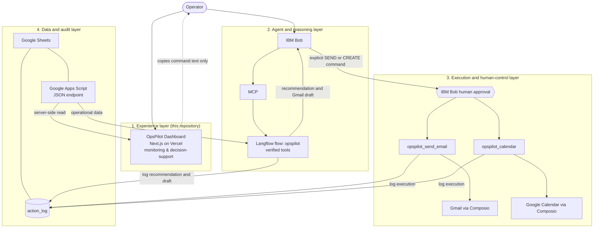

# OpsPilot Architecture

OpsPilot separates **seeing and reasoning** from **consequential execution**. The system has four layers. The first lives in this repository; the other three describe the surrounding agent, execution and data setup that the dashboard connects to.



## Design principle

> **Natural-language agreement alone is not authorization for consequential actions.**

Early testing showed that relying only on agent instructions to prevent unintended sends was not sufficient. The final design therefore enforces the boundary structurally: the reasoning flow *cannot* send email or create calendar events, and the tools that can are separate and gated by IBM Bob's human approval.

## The four layers

### 1. Experience layer: OpsPilot Dashboard

A Next.js (App Router) website deployed on Vercel. It provides operational visibility, priority monitoring, decision support, action-lifecycle visibility and audit history.

- Reads the operational dataset **server-side** from the Apps Script endpoint. The endpoint URL is an environment variable and is never sent to the browser.
- Derives everything (KPIs, priorities, Action Center lifecycle, activity labels) with deterministic functions in `lib/opspilot/`. Overdue days are recomputed from due dates in the Asia/Jakarta time zone.
- Offers **no execution**. Buttons open drawers or copy IBM Bob commands (`Handle <ID>`, `SEND <ID>`, `CREATE <ID>`). The only server action, `refreshOpsPilotData`, expires a cache tag so data is re-read; it calls no external service and writes nothing.
- Status is evidence-based: an item is *Executed* only when the `action_log` contains a confirmed success entry; unknown statuses are never treated as success.

### 2. Agent and reasoning layer

The operator talks to **IBM Bob**, which reaches the OpsPilot tools over **MCP**, served by **Langflow**.

The main flow, `opspilot`, may:

- analyze operational data
- verify entity context (for example that `INV-017` exists and is overdue)
- recommend actions with an explanation
- create Gmail **drafts**

It must **not** send email or create calendar events.

Reasoning path: `IBM Bob → MCP → opspilot → verified tools`.

### 3. Execution and human-control layer

Consequential actions exist only in two separate MCP tools, each backed by its own Langflow flow:

| Tool | Action | External service |
|---|---|---|
| `opspilot_send_email` | Send a prepared Gmail draft | Gmail through Composio |
| `opspilot_calendar` | Create a calendar event | Google Calendar through Composio |

IBM Bob keeps **human approval enabled** for both tools. The operator must issue an explicit command (`SEND <ID>` or `CREATE <ID>`) and then approve the tool call. Duplicate protection prevents an action already recorded as executed from being repeated.

**Email execution:** `IBM Bob → human approval → opspilot_send_email → Gmail → action_log`

**Calendar execution:** `IBM Bob → human approval → opspilot_calendar → Google Calendar → action_log`

### 4. Data and audit layer

Google Sheets is the operational source of truth, exposed as JSON through Google Apps Script. The dataset contains customers, invoices, tasks, meetings and the `action_log`.

The `action_log` records recommendations, Gmail drafts, sends, calendar events and failures, with the user decision, execution status, recipient and message or event IDs. The dashboard's Action Center and Activity pages are built from it.

## Why execution is separate from reasoning

| Concern | Single combined flow | Separated flows (OpsPilot) |
|---|---|---|
| Can the model send email on its own? | Possibly, if instructions fail | No, the reasoning flow has no such tool |
| Where is approval enforced? | In prompt wording | In IBM Bob tool approval, outside the model's control |
| Blast radius of a reasoning error | Real-world side effect | A wrong recommendation or draft the operator can inspect |
| Auditability | Mixed with reasoning traces | One clear execution event per action |

## Data flow end to end

```
Operational data
  → Analysis (opspilot)
  → Prioritization (dashboard + opspilot)
  → Recommendation (explained, with verified entity context)
  → Prepared action (Gmail draft)
  → Explicit command (SEND / CREATE)
  → IBM Bob human approval
  → External execution (Gmail / Calendar)
  → Action log
  → Duplicate protection
```

## Dashboard data fetching (summary)

The dashboard fetches the dataset on the server with request deduplication, a short revalidation window (about 20 seconds), a 12-second timeout per attempt, at most 2 attempts for transient read failures (timeout, connection error, 5xx, 408, 429), and a friendly fail-closed error state. There is no fake fallback data. A manual Refresh / Retry control expires the cache.

## Scope note

The Langflow flows and IBM Bob configuration are **not** part of this repository. This document describes their intended roles as designed for the project; the repository itself contains the dashboard, which only displays their results.
